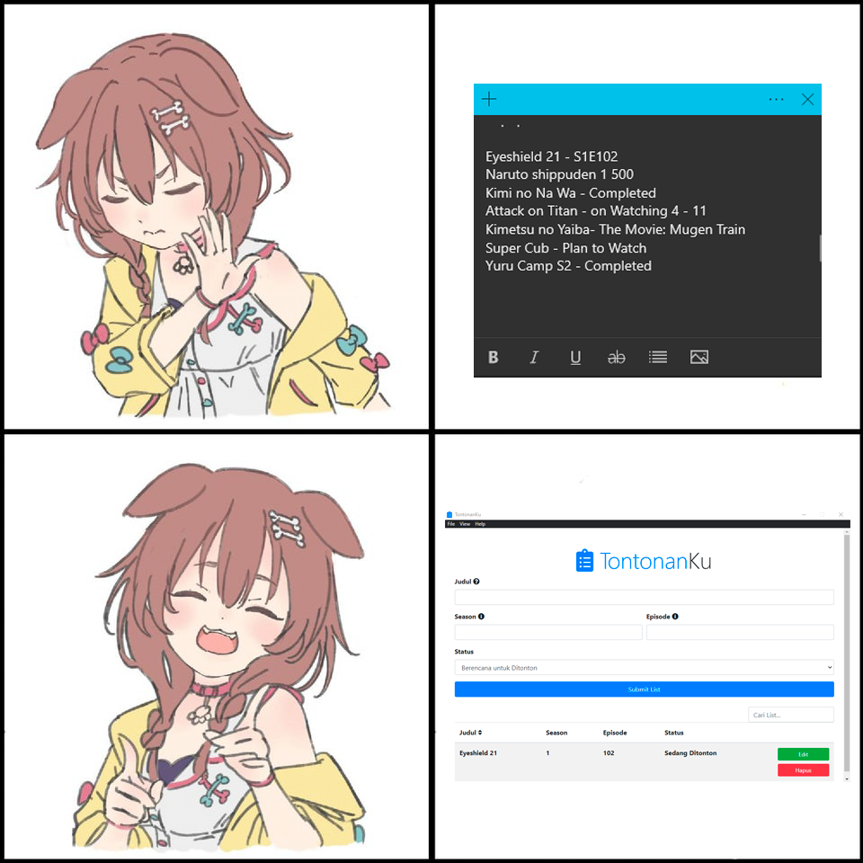

 # 📝 TontonanKu 📋 

> **Aplikasi Desktop untuk Melihat List Tontonan**

---

### Details 
*   **Size:** 

*   **Tanggal Rilis: 11 Maret 2021**   

    - **Rilis Terbaru: 1 Juni 2021**  

*   **Platform: Windows**  

*   **Total Downloads:** 

<!-- *   **Developer: Iqbal Anggoro | Publisher [Baja Softworks](https://baja-softworks.github.io)** -->

### [Download disini!](https://github.com/Baja-Softworks/TontonanKu/releases/download/v1.0.0/TontonanKu-Setup-1.0.0.exe)

---

### Bantuan, Lapor Bug, dan Umpan Balik
**Twitter:** [@bajasoftworks](https://twitter.com/bajasoftworks) | **Instagram:** [@bajasoftworks](https://instagram.com/bajasoftworks)

### Support / Donasi
- [Trakteer](https://trakteer.id/bajasoftworks)

### Lisensi
MIT
<!-- [MIT](https://github.com/Baja-Softworks/TontonanKu/blob/main/LICENSE.md) -->

### Notes / ToDo
- [x]  Fitur Update
- [x]  Dapat digunakan Secara Offline
- [ ]  Cross platform (Hanya Support Platform OS Windows)

